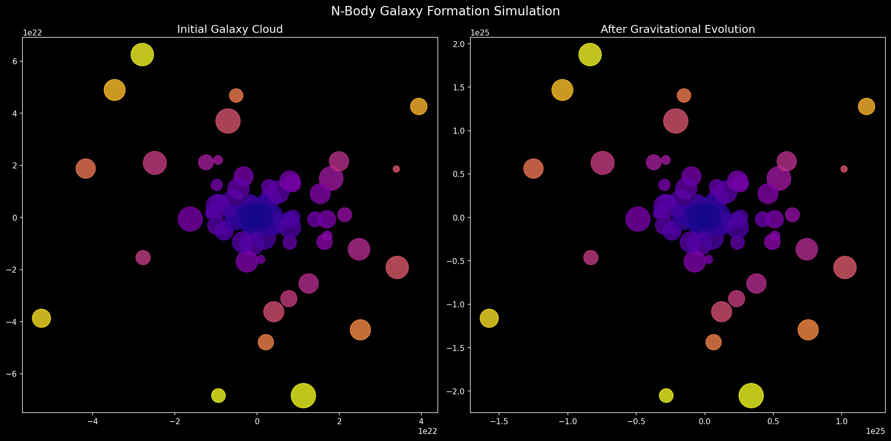
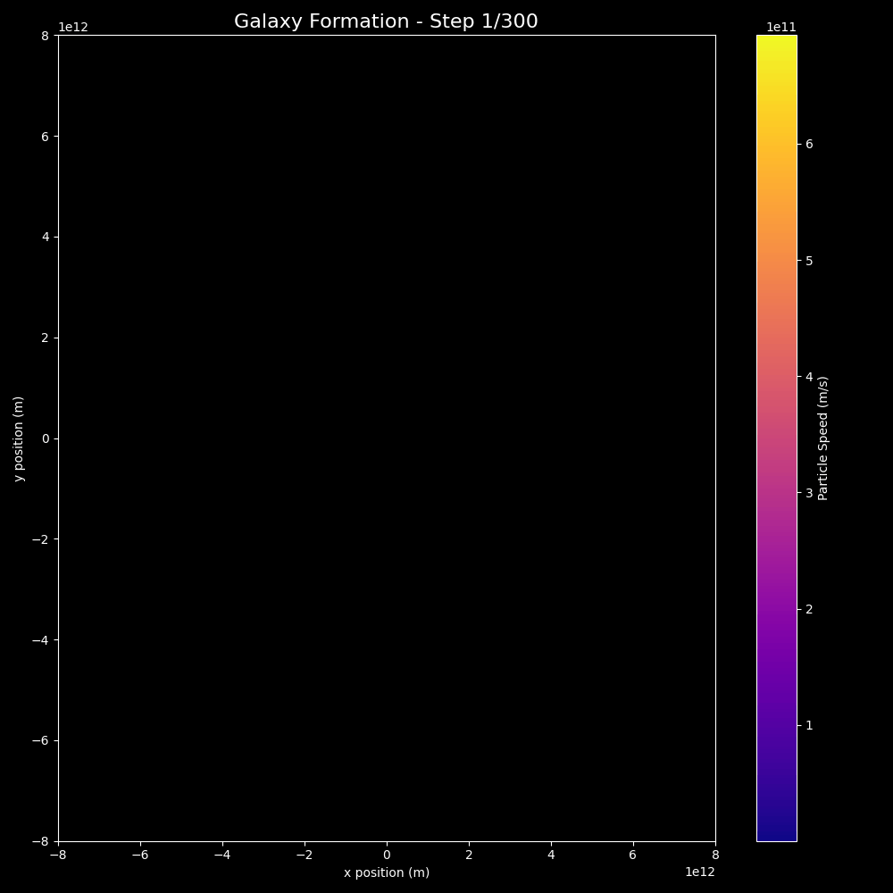

# Computational Astrophysics Journey 🚀

I am a bscit student documenting my transition into computational astrophysics through numerical simulations. My goal is to build a foundation in high-performance computing and celestial mechanics.

---

## Project 1: Planetary Orbit Simulator
This project uses the **Euler-Cromer numerical integration method** to simulate stable planetary orbits. Instead of using pre-calculated paths, the satellite's position is updated step-by-step using Newton's Universal Law of Gravitation.

### 📊 Simulation Result: Mars Orbit
Below is a high-resolution simulation of a satellite at a 500km altitude around Mars. The code automatically calculates the required circular velocity (~2989 m/s) to maintain a stable trajectory.

### 🛠️ Technical Implementation
- **Language:** Python 3
- **Numerical Method:** Euler-Cromer Integration ($dt = 10s$)
- **Key Libraries:** NumPy (Vector Math), Matplotlib (Scientific Visualization)
-

## Project 2: Star Formation - Gravitational Collapse
https://colab.research.google.com/drive/1l6jWKq6-3o81_gFxj1xoGH4IELiX5iue?usp=sharing

N-body simulation of 10 particles collapsing under mutual gravity,
simulating early star formation from a gas cloud.

### Initial Cloud

### After Gravitational Collapse

### What I Learned
so n body stimulation elevated my understanding of star formation.
that how in initial cloud all the dust particles and gas were scattered and distant from each other, which were later pulled together 
from the mutual gravity resulting in formation of gravitational collapse where most of gas and particles are clumped together 
resulting in the formation of star .
we also see some of the particles that do not participate in formation,
these particles later forms their own seprate star system or either become rogue planets.
"This simulation uses Newton's Law of Gravitation (F = GMm/r²) applied to N particles simultaneously, with a softening parameter to prevent numerical errors at close range."

### Physics Concepts
- Gravitational collapse
- N-body dynamics
- Jeans Instability

## Project 3: N-Body Galaxy Formation Simulation

200 particles simulated under mutual gravitational attraction,
forming a galaxy-like structure from an initial rotating disk.

### Simulation Result

### Animation

### Physics Concepts
- Newton's Law of Gravitation F = GMm/r²
- N-body gravitational dynamics
- Disk galaxy initial conditions using polar coordinates
- Softening parameter to prevent numerical errors
- Euler numerical integration

### What I Learned
* Overview

This project simulates the formation and evolution of a simplified galaxy using an N-body gravitational system.
A total of 200 particles are initialized in a rotating disk configuration, and their interactions are computed over time using gravitational physics. The simulation demonstrates how complex galactic structures can emerge from simple physical laws.

* Objective

  -To understand how gravitational interactions between particles lead to the formation of structures such as clusters and rotating systems, similar to real galaxies.
  
* Methodology

Particles are randomly distributed in a disk-like structure
Each particle is assigned:
Random mass
Initial position
Velocity for approximate circular motion
Gravitational forces are calculated using Newton’s Law of Gravitation
System evolves over 300 timesteps
Positions and velocities are updated at each step
To avoid numerical instability:
A small softening factor (epsilon) is added to distance calculations

* Physics Used

  -Every particle interacts with every other particle
  -Total interactions per step: 200 × 200 = 40,000
  -Total calculations ≈ 12 million over the simulation

* Observations

  -Heavier particles attract nearby particles and form dense clusters
  -Lighter particles are often pushed outward or escape
  -The system begins to resemble basic galactic behavior
  -Emergent structures form without any predefined pattern

* Visualization

! Blue/Purple →  (slow particles)
! Yellow/Orange →  (fast particles)

* Tech Stack

   -Python
   -NumPy
   -Matplotlib / Visualization tools

* Key Learnings

   -Understanding of N-body simulations
   -Practical use of gravitational physics
   -Handling numerical instability using epsilon
   -Observing emergent behavior in complex systems
