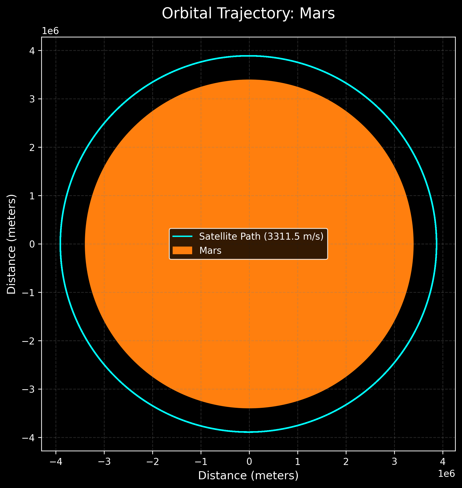
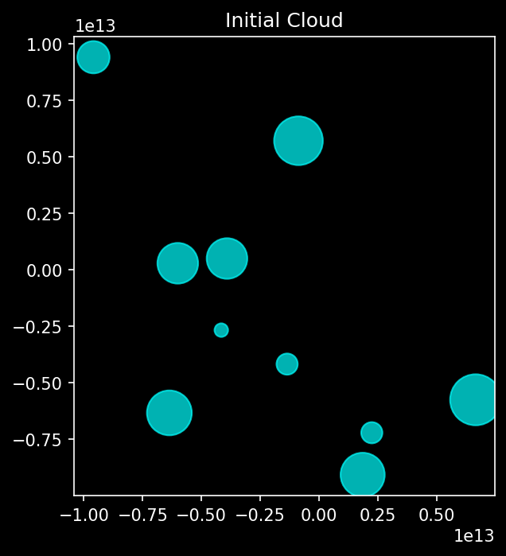
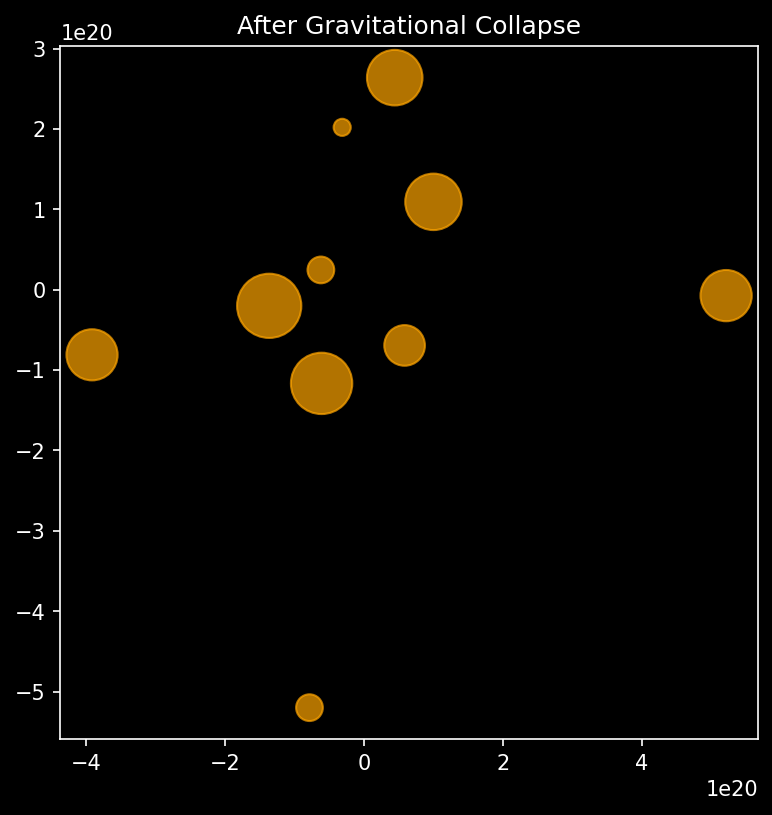

# Computational Astrophysics Journey 🚀

I am a bscit student documenting my transition into computational astrophysics through numerical simulations. My goal is to build a foundation in high-performance computing and celestial mechanics.

---

## Project 1: Planetary Orbit Simulator
This project uses the **Euler-Cromer numerical integration method** to simulate stable planetary orbits. Instead of using pre-calculated paths, the satellite's position is updated step-by-step using Newton's Universal Law of Gravitation.

### 📊 Simulation Result: Mars Orbit
Below is a high-resolution simulation of a satellite at a 500km altitude around Mars. The code automatically calculates the required circular velocity (~2989 m/s) to maintain a stable trajectory.

### 🛠️ Technical Implementation
- **Language:** Python 3
- **Numerical Method:** Euler-Cromer Integration ($dt = 10s$)
- **Key Libraries:** NumPy (Vector Math), Matplotlib (Scientific Visualization)
-

## Project 2: Star Formation - Gravitational Collapse

N-body simulation of 10 particles collapsing under mutual gravity,
simulating early star formation from a gas cloud.

### Initial Cloud

### After Gravitational Collapse

### What I Learned
so n body stimulation elevated my understanding of star formation.
that how in intial cloud all the dust particles and gas were scattered and distant from each other, which were later pulled together 
from the mutual gravity resulting in formation of gravitational collapse where most of gas and particles are clumpsed together 
resulting in the formation of star .
we also see some of the particles that do not participate in formnation,
these particles later forms thier own seprate star system or either become rogue planets.

### Physics Concepts
- Gravitational collapse
- N-body dynamics
- Jeans Instability
